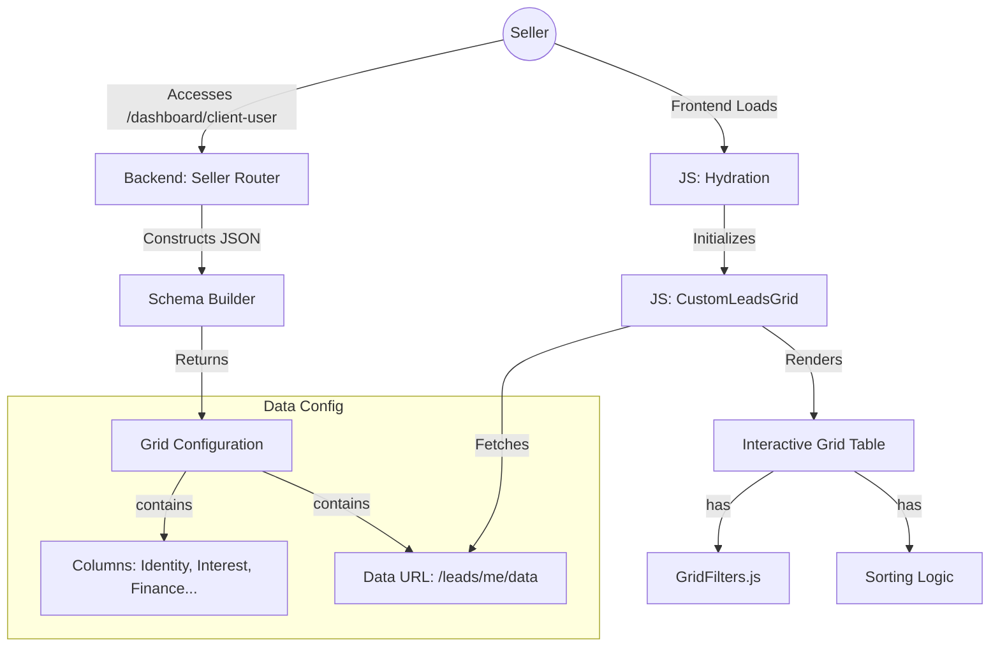

# Porting Lead Grid to Clean Branch (V2)

**Goal**: Restore the functional "Custom Lead Grid" for Sellers on a fresh feature branch, ensuring backend stability (proper python packages) and frontend consistency (correct JS engine).

## Architecture Overview

We will restore the `seller_workspace` module to serve the Grid configuration, and the `CustomLeadsGrid` engine to render it.

## Proposed Changes

### Backend: Structure Cleanup (Critical)

We must remove the unauthorized folders left over from the previous experiment to avoid confusion.

#### [DELETE] Unauthorized Modules
- `backend/app/dashboards/manager_workspace/`
- `backend/app/dashboards/seller_workspace/`

### Backend: `app/dashboards/client_user_dash/` (Target)

We will modify this existing standard module to serve the Grid.

#### [VERIFY] `__init__.py`
- Ensure it exists.

#### [MODIFY] `router.py`
- Endpoint: `@router.get("/client-user")`
- Logic: Fetch stats.
- Returns: `get_client_user_schema(...)`

#### [MODIFY] `schema.py`
- **Key Change**: We will replace the "Cards" layout with the **Lead Grid** configuration.
    - `type: "custom-leads-grid"`
    - `data_url: "/leads/me/data"`
    - `columns`: (Identity, Engagement, Finance, Timeline, Match, Info, Outcome).
    - `enableFilters: true`

#### [MODIFY] `app/main.py`
- Cleanup: Ensure `manager_workspace` and `seller_workspace` are NOT imported.
- Ensure `client_user_dash` IS registered.

---

### Frontend: `renderer/engine/`

#### [NEW/RESTORE] `CustomLeadsGrid.js`
- The core engine class.
- Must export `CustomLeadsGrid`.
- Must handle:
    - `render()` headers with icons.
    - `renderBody()` with scoring pills.
    - `GridFilters` integration.

#### [MODIFY] `hydration.js`
- Import: `import { CustomLeadsGrid } from './CustomLeadsGrid.js'`
- Initializer: `new CustomLeadsGrid(...)`

#### [MODIFY] `registry.js`
- Map: `'custom-leads-grid': LinkCustomGridContainer`

## Verification Plan

1. **Backend Health**: Verify `GET /dashboard/client-user` returns Status 200 and correct JSON structure.
2. **Frontend Load**: Verify Main Dashboard loads without "Connection Timeout".
3. **Grid Functionality**:
    - Verify Table renders rows (not cards).
    - Verify Icons in Headers.
    - Verify Search/Filter bar appears.
