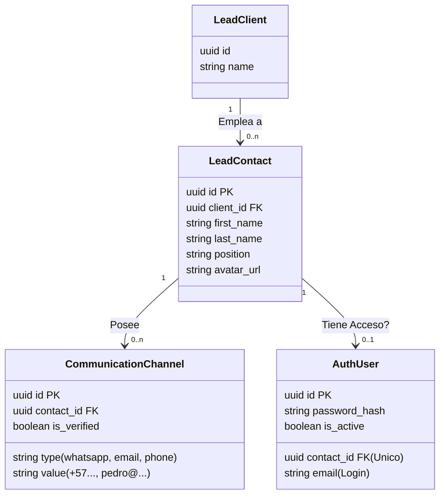

# Propuesta Arquitectónica: Modelo Unificado de Contactos y Usuarios
**Fecha:** 2026-01-09
**Estado:** Propuesta / Borrador

## 1. El Problema ( "El Dilema del Huevo y la Gallina" )
Actualmente, el sistema enfrenta fricción al manejar la información de contacto (teléfonos, emails, canales) debido a la separación rígida entre dos conceptos:
1.  **Usuarios (`auth_users`)**: Personas con credenciales de acceso (login).
2.  **Contactos Corporativos**: Personas que trabajan en un Cliente (ej. "Pedro Ventas", "Eliana Asistente") pero que no necesariamente entran al sistema.

**Problemas actuales:**
*   Duplicidad de datos si un Contacto se vuelve Usuario.
*   Ambigüedad sobre dónde guardar un canal (¿Es el WhatsApp del Usuario o del Contacto?).
*   Tablas "aplanadas" como `lead_client_channels` que mezclan canales con nombres de personas (`internal_name`).

## 2. La Solución: Estrategia "Persona-Céntrica"

### Concepto Clave
Separar **Identidad** (Quién es) de **Acceso** (Qué puede hacer).

*   **Identidad (`lead_contacts`)**: Es la entidad base. Toda persona real es un Contacto. Tiene nombre, foto, cargo y **CANALES**.
*   **Acceso (`auth_users`)**: Es una capa técnica opcional. Si un Contacto necesita entrar al software, se le "adjunta" un Usuario.

### 3. Nuevo Esquema de Datos Propuesto

## 4. Flujos de Trabajo "Sin Fricción"

### Caso A: Empleado sin Acceso (ej. Asistente, Personal Operativo)
1.  Se crea el registro en `LeadContact` ("Eliana").
2.  Se agregan sus canales en `CommunicationChannel` (Teléfono, Email).
3.  **Resultado**: El sistema tiene sus datos para enviarle notificaciones o contactarla, pero ella no consume una licencia de usuario ni tiene login.

### Caso B: Empleado con Acceso (ej. Vendedor, Gerente)
1.  Se crea el registro en `LeadContact` ("Pedro").
2.  Se agregan sus canales.
3.  **Acción**: Admin hace clic en "Dar Acceso al Sistema".
4.  Se crea registro en `AuthUser` vinculado a ese `contact_id`.
5.  **Resultado**: Pedro entra con su email/pass. Su perfil (foto, nombre) viene de su ficha de Contacto.

### Caso C: Rotación de Personal (Salida)
1.  Pedro deja la empresa pero sigue siendo un contacto comercial (ej. se vuelve proveedor).
2.  **Acción**: Se borra (o desactiva) solo la fila de `AuthUser`.
3.  **Resultado**: Pedro ya no puede entrar, pero su historial de chats, su teléfono y su nombre permanecen intactos en el sistema como un Contacto histórico.

## 5. Ventajas Técnicas
1.  **Fuente Única de Verdad**: Los canales (WhatsApp, Email) siempre pertenecen a una Persona (`LeadContact`), nunca a un "Usuario" etéreo ni a un "Cliente" genérico.
2.  **Escalabilidad**: Fácil de migrar a un modelo donde una Persona pertenezca a múltiples Clientes (simplemente cambiando la relación a N:N si fuera necesario en el futuro).
3.  **Limpieza**: `auth_users` se vuelve una tabla puramente técnica (credenciales), reduciendo el riesgo de exponer datos personales en consultas de autenticación.
